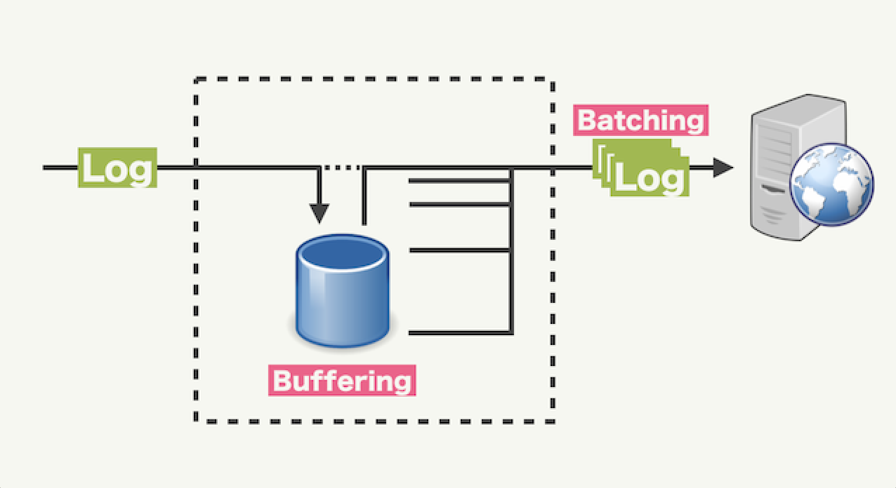

Puree
====


## Description

It is inefficient that send logs every time events are fired. So you should implement buffering, retrying, validation, ...
Puree is a data collector for unified logging layer, which provides some functions like below

- Filtering
 - Enable to interrupt process before sending log.
- Buffering
 - Store logs to beffere until log was sent.
- Batching 
 - Enable to send logs by 1 request.
- Retrying
 - Retry to send log after some time automatically if sending has failed.


## Usage

### Initializing

Configure Puree on application created.

```java
public class DemoApplication extends Application {
    @Override
    public void onCreate() {
        Puree.initialize(buildConfiguration(this));
    }

    public static PureeConfiguration buildConfiguration(Context context) {
        return new PureeConfiguration.Builder(context)
                .beforeEmitAction(new AddRequiredParamsFilter())
                .registerOutput(new OutLogcat())
                .registerOutput(new OutBufferedLogcat())
                .build();
    }
}
```

### Sending logs

Log class should implements Log interface, and define type of output plugin.

```java
public class ClickLog extends Log {
    @SerializedName("page")
    private String page;
    @SerializedName("label")
    private String label;

    public String type() {
        return OutBufferedLogcat.TYPE;
    }

    public ClickLog(String page, String label) {
        this.page = page;
        this.label = label;
    }
}
```

Shed log to Puree in an arbitrary timing.

```java
Puree.in(new ClickLog("MainActivity", "Hello"));
```

### Testing

LogSpec provides utilities for tests.

```java
public class ClickLogTest extends AndroidTestCase {
    public void testFormat() {
        new LogSpec(DemoApplication.buildConfiguration(getContext()))
                .logs(new ClickLog("MainActivity", "ClickLog1"),
                        new ClickLog("MainActivity", "ClickLog2"),
                        new PvLog("MainActivity"))
                .target(OutBufferedLogcat.TYPE)
                .shouldBe(new LogSpec.Matcher() {
                    @Override
                    public void expect(List<JSONObject> serializedLogs) throws JSONException {
                        assertEquals(2, serializedLogs.size());
                        JSONObject serializedLog = serializedLogs.get(0);
                        assertEquals("MainActivity", serializedLog.getString("page"));
                        assertEquals("ClickLog1", serializedLog.getString("label"));
                        assertTrue(serializedLog.has("event_time"));
                    }
                });
    }
}
```

### Create output plugins


There are two types of output plugins: Non-Buffered, Buffered.

- Non-Buffered output plugins do not buffer data and immediately write out results.


- Buffered output plugins store logs to local storage temporary.



You can create a plugin by inheriting Puree.Output or Puree.BufferedOutput. See example plugins below.

```java
public class OutLogcat extends PureeOutput {
    public String type() {
        return "logcat";
    }

    @Override
    public Configuration configure(Configuration conf) {
        return conf;
    }

    @Override
    public void emit(JSONObject serializedLog) {
        Log.d("OutLogcat", serializedLog.toString());
    }
}
```

```java
public class OutBufferedLogcat extends PureeBufferedOutput {
    public String type() {
        return "buffered_logcat";
    }

    @Override
    public Configuration configure(Configuration conf) {
        conf.setFlushInterval(2000);
        conf.setLogsPerRequest(3);
        return conf;
    }

    @Override
    public void emit(List<JSONObject> serializedLogs, AsyncResult asyncResult) {
        JSONArray log = new JSONArray();
        for (JSONObject serializedLog : serializedLogs) {
            log.put(serializedLog);
        }
        Log.d("OutBufferedLogcat", log.toString());

        asyncResult.success();
    }
}
```

## Install


Clone this repository in your PC and compile with your project for now.
I'll upload Puree to maven central sooner or later.

```java
// settings.gradle
include ':app', ':..:Puree:library', ':..:Puree:plugins'

// app/build.gradle
compile project(':..:Puree:library')
compile project(':..:Puree:plugins')
```
